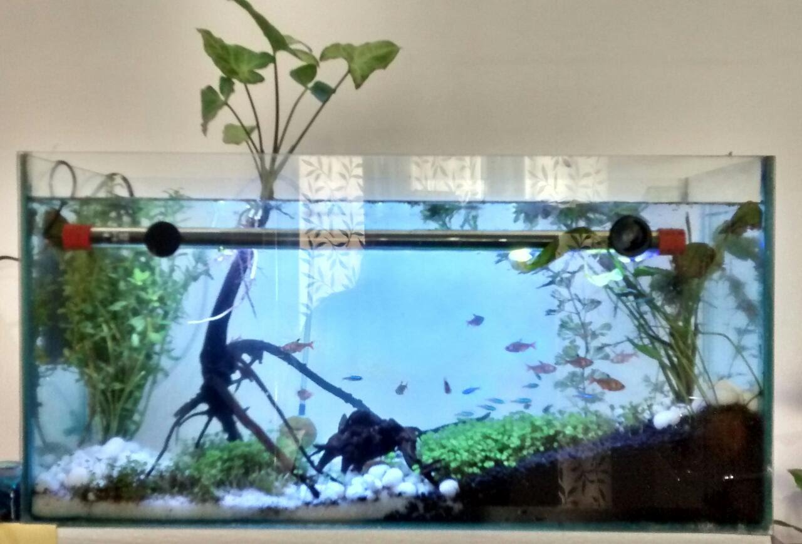
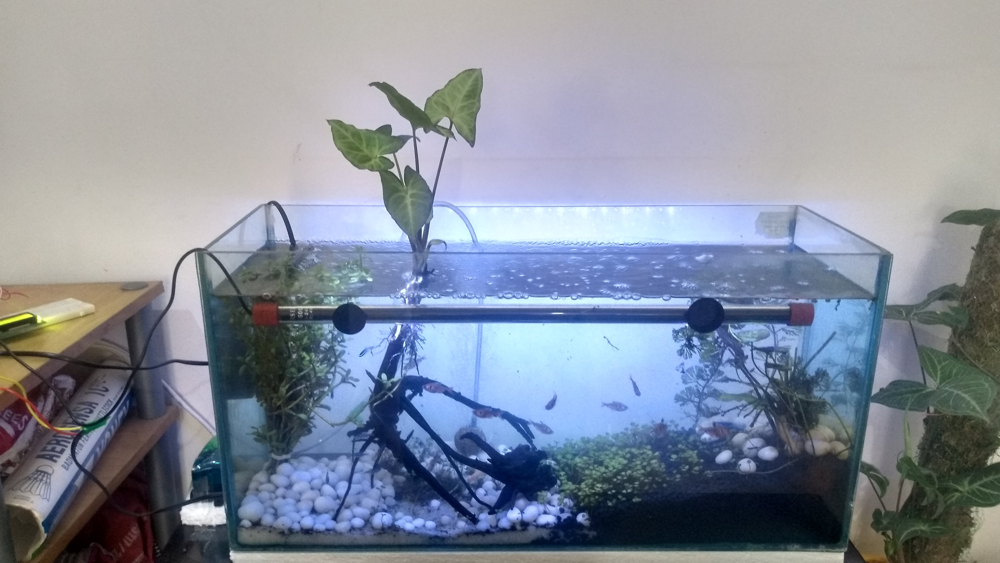
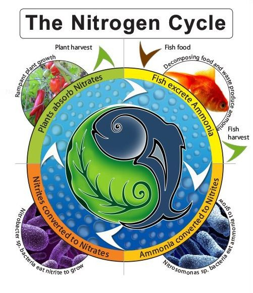
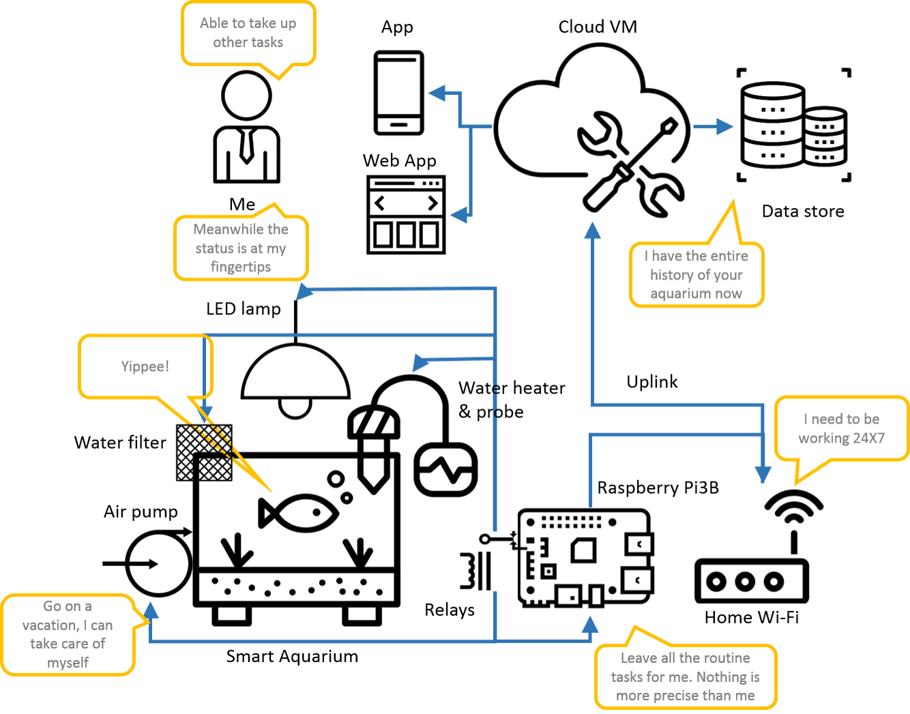
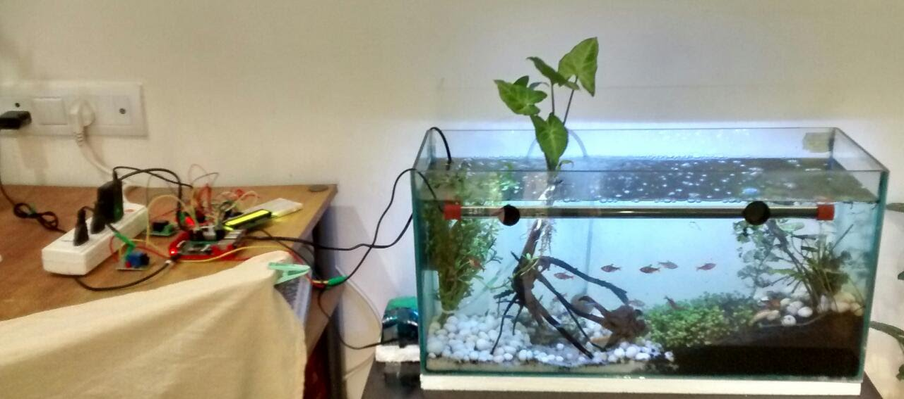

### My aquarium and IoT :

> I know !, this IoT thingee has gone just too far this time. Seriously?  now you don't want to tend your fish too ? Why get an aquarium in the first place when you prefer to leave that to machines too !

A typical automation naysayer can be spotted here or there quoting such counters to ideas such as these. We on the other hand are sane to understand that while machines take over the drudgery of repetitive tasks , in turn allow us to focus on higher / more complex tasks.

>Urban farming would take over some day, and we would be compelled to design efficient ways of getting chemical-free food to our tables using the least of natural resources, if not then find ways to recycle them.

I just went ahead of myself there, but back on planet `reality` we just hope the `theory of emergence` is working its ways , pointing us to create what could be building blocks of urban vertical farming.

[Some interesting video on theory of emergence](https://youtu.be/16W7c0mb-rE)

### All natural elements aquascape

We have made an attempt to keep all the items in the aquarium __natural__ with minimum interference from plastic / metallic or non biological items. This renders the system pristine and very conducive to the marine life. In an effort to enact the exact natural environment for the fish we have used :

1. Glossed pebbles
2. Active carbon clay substratum
3. Dwarf baby tears lawn - grown from seeds [Glossotigma Hemianthus](https://en.wikipedia.org/wiki/Hemianthus_callitrichoides)
4. Polished drift wood

### Is that an aquapone ?

__Yes it is !__. We have simple [syngonium snippet](https://www.ourhouseplants.com/plants/syngonium) drafted on the drift wood , growing away from the water surface, with its roots submerged. The plant uses up the `nitrates` in the water which formed from `nitrites` which in turn are the byproducts of `ammonia` from the fish waste.

Here is the illustration of how the aquaponic cycle works:

[Original image here](http://www.backyardaquaponics.com/information/the-nitrogen-cycle/)

At the current stage, we are not interested in harvesting consumable foliage / fruits from the plants. This system would strive to be a testimony for automated aquaponic system and if it can be sustained we can later extrapolate this to consumable plant products too.

> A cloud connected, precision clock controlled , sensing and device management system for maximizing gain from an aquaponic system is central to the purpose of the project.

### Project Aquascape minder:

A healthy aquarium with all natural aqua scape has precision controlled parameters. While the marine life can sustain some aberrations , it is best to have close control over the water body parameters.

Here is what our water body has now , not very diverse marine life.

|Item|Quantity|
|-----|-----|
|Serphae Tetra fish|11|
|Chinese golden algae eater|2|
|Neon Tetra fish|12|
|Green ring turtle|1|

>All the enlisted are tropical life and tolerate a temperature of about 21oC to about 27oC, 6hours of LED light :4 Watts, and aeration of approximately 6 hours.

|Paramter|Control|Status|
|----|----|----|
|Illumination|Clock controlled, 6-8 /day hours of ON time using 4W LED|Done,currently under test/ observation|
|Aetration|Clock controlled , 7-9 /day hours for 35ltrs water body|Done!,currently under test/observation|
|Filtration|Clock controlled , 10-12 hours/ day|Done !, under test / observation|
|Feeding| 2 feeds / day , Midday, & Supper| Feeding mechanism being designed, servo controlled automatic|
|Temperature|Maintain 21oC to 27oC , using analog water temperature sensor|Temperature sensor procurement|
|pH|Maintain 6.8 to 7.0 pH to avoid ammonia accumulation|Water drain mechanism under design, pH Sensor out of budgets for the project|

While aquarists would argue that this is not much of a task switching off / on certain accessories of the aquariums at any time during the day, automation systems allow you a chance to monitor higher parameters taking control of the drudgery of keeping a schedule clock of the aquarium. One may realize how vital this is when away from the aquarium.

> Don't you want someone to tend your pets while you are on your vacation ? Would you trust someone else's approximation of food and put the habits of your pets at stake ?

- __One__ is , it leaves the repetitive precision controlled tasks to the microprocessor (RPi in this case) and sets you free from having to keep a track of the sensitive schedule. You can leave your home WiFi ON and this would mean the system smoothly controls all electrical equipment as per the schedule. Setting the schedule is also an one time activity from either your android or your desktop.

- __Two__ is you have a remote handle / track of the electrical accessories and can even alter the schedule, force a restart on the system. Incase of emergency you can switch to manual mode and hijack control from the microprocessor. Casein - you know when to switch ON / OFF which accessory. Upon restart , the system then picks up internet local time and resumes the schedule from where it had left / crashed

> Electronic system that helps you program a schedule for your aquarium and its electrical accessories, and keep a track of the same remotely. A time keeper for all the accessories maintaining optimal ON / OFF time

### What we are currently not doing :

1. We currently are unable to keep a track of the pH levels in the water body.
2. Nitrate / Nitrite concentration -a typical aquaponic system would need that.
3. Water turbidity and keep a measured record of the same.  - This also measures the efficiency of the filtering system.
4. Photograph of the tank that denotes the current state
5. Water temperature , this helps us schedule the water heater.

### But we intend to get these rolled out soon :

1.  Temperature probe that helps keep a track of the water temperature and schedule the heater to maintain it comfortable for the tropical marine life.
2. pH sensors - current cost restrictions are keeping us from doing this.
3. Manual mode override : There are unforeseen events when you would want to hijack control from the system , interrupt the schedule and play various accessories at times other than scheduled.
4. Settings changed on the cloud should force a restart of the services with the new setting.

### Technology stack

|Technology|Used for|Remarks|
|----|----|----|
|Raspberry Pi|Central microprocessor used for programmed controlling|RPi3B+ 2GB RAM|
|Python software on RPi|Program running on the microprocessor helps to time and control everything|Python RPiGPIO|
|Cloud endpoints|HTTP REST cloud endpoints are the gateway for the microprocessor to store away settings and state. This is is what gets us the remoting capability|Django HTTP services|
|Web App|Responsive web application for devices of all aspect ratios |HTMLCSS web app that works on mobile as well on desktops|

### Schedule used for default behavior

|Time slot|Indexing|LED|Air pump|Filter|Feeder|
|-----|-----|-----|-----|-----|-----|
|06:00-11:59|Rise and shine|ON|ON|OFF|OFF|
|12:00-13:59|Mid day calm|OFF|OFF|OFF|ON|
|14:00-14:59|Mid day cleanup|OFF|ON|ON|OFF|
|15:00-17:59|Late afternoon|OFF|ON|OFF|OFF|
|18:00-18:59|Twilight|ON|ON|OFF|OFF|
|19:00-19:59|Supper|ON|OFF|OFF|ON|
|20:00-21:59|Night|ON|OFF|ON|OFF|
|22:00-23:59|Midnight|OFF|OFF|ON|OFF|
|00:00-03:59|Dark night|OFF|OFF|OFF|OFF|
|04:00-05:59|Dark night|OFF|OFF|ON|OFF|

### Scheduling and Cron jobs :

Central to the functioning of the automated aqua scape is the microprocessor's clock (which it gets the current local time from the internet ) and the ability to setup __cron jobs__. We have used the [apscheduler](https://apscheduler.readthedocs.io/en/latest/) to do just that.

`apscheduler` is a easy way to schedule __cron jobs__ `decoratively`
