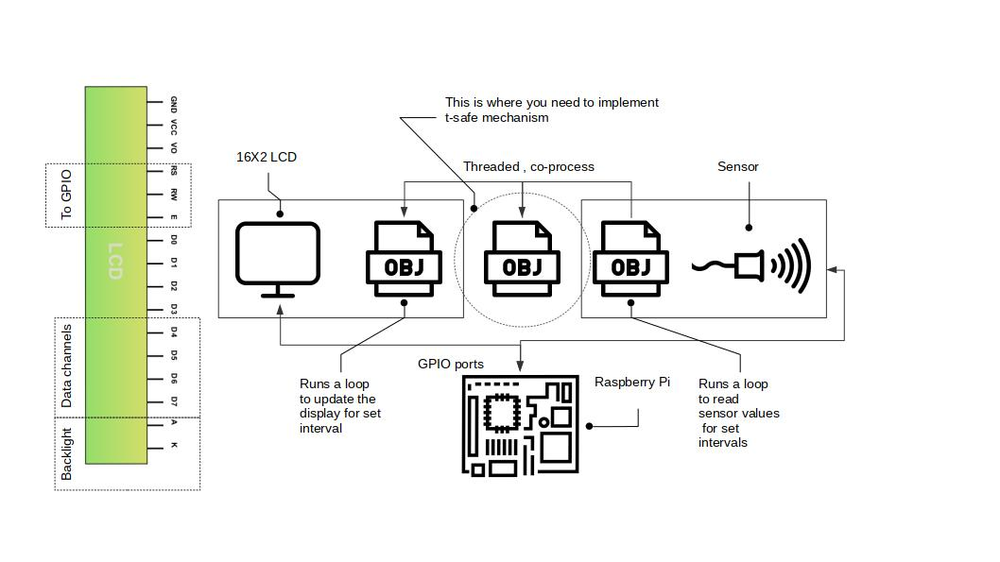

#### Thread safe 16X2 LCD 4 channel mode on Raspberry Pi3B
----

You would often find yourself wrestling around with the connections for an LCD and the Adafruit library [here](https://github.com/adafruit/Adafruit_Python_CharLCD). They have distilled the entire setup and personally I feel it cannot be any more easier than that. But there is always that odd spot where you find either a blank screen or screen full of just contratsting boxes. Afterall, 4 data, 2 selects, and couple of supply voltages makes it too many connections. (Just bumps up the number of possibilities you may go wrong) Either of the cases , after some efforts when you finally get the basic text display on the screen you are hoping that it would be an easy ride ahead of this.

> Mixing threads and the LCD, that is not so fast, can leave you with a LCD with alien characters on the screen. While it can excite some of you thinking it to be some message from the Decepticons :) , it really is some issue with the underlying threaded applications. Were you wondering how to make your LCD work in n-threaded environment ?



I have illustrated how your software objects could be when you are working with one or more sensors letting their data display on screens like a 16X2 LCD.In either of the cases you would an thread safe data object , representing the object model of the solution in entirety. 

#### TSafe Object that implements thread lock :
----

I know most of you Python stalwarts would boo me down when I mention `threading.Lock()` but for the simple case we are talking about , something as raw as thread Lock is sufficient. Moreover I dont want to make this discussion around `threading` in Python. A simple thread locked data object may end up looking like this

```python
class TSafeDashB():
    def __init__(self,*args, **kwargs):
        self._temp = None
        self._light=None
        self._co2=None
        self._co=None
        self._aqi=None
        self._lck  = threading.Lock()
    def put(self,temp=None,light=None,co2=None,co=None,aqi=None):
        self._lck.acquire()
        if temp !=None:
            self._temp=temp
        if light!=None:
            self._light=light
        if co2!=None:
            self._co2=co2
        if co!=None:
            self._co=co
        if aqi!=None:
            self._aqi=aqi   #this comes from the alarm system
        self._lck.release()
        return None
    def temp(self):
        self._lck.acquire()
        result = self._temp
        self._lck.release()
        return result
```

A keen eye can make out it is a simple ambience sensing project perhaps , a couple of sensors that `put` their value to the `TSafeDashB`. Please note how each of the data modification operation under the vigilance of a threading lock. The same TSafeDashB then allows the LCD to fetch values using functions like `temp()`, also not without having acquired the `lock`

#### Sensing and Displaying can be tasks running on co-operative threads :
----

What a novice programmer might prefer is updating the display only after the sensor voltages are read back in and the calculations are done. This renders the LCD a bit patchy , feels like the display has a stammer. The solution here is to get it on a thread (but still co-processed) along with the sensing loop. 

A display update could be more frequent giving it a responsive outlook. Sensing loops ofcourse can have custom intervals at which you would like to measure the physical phenomenon.


#### References
---

- [Raspberry Pi Icon, DesignBite at Noun project](https://thenounproject.com/)
- [LCD Display icon, Deemak Dakshina at Noun project](https://thenounproject.com/)
- [Software Object icon, Arthur Shlain at Noun project](https://thenounproject.com/)
- [Sensor icon, Duy Shung at Noun project](https://thenounproject.com/)
- [Cover image](http://www.circuitbasics.com/raspberry-pi-lcd-set-up-and-programming-in-python/)

#### Notes 
----

- My Raspberry runs python3.5 on Raspbian Jessie
- 16X2 LCD HD44780U , is a green backlight LCD
- I have tested the LCD working for about 48 hours continuous. The above method has not yet scrambled the LCD
- Im using `threading.Thread` standard threading library 
